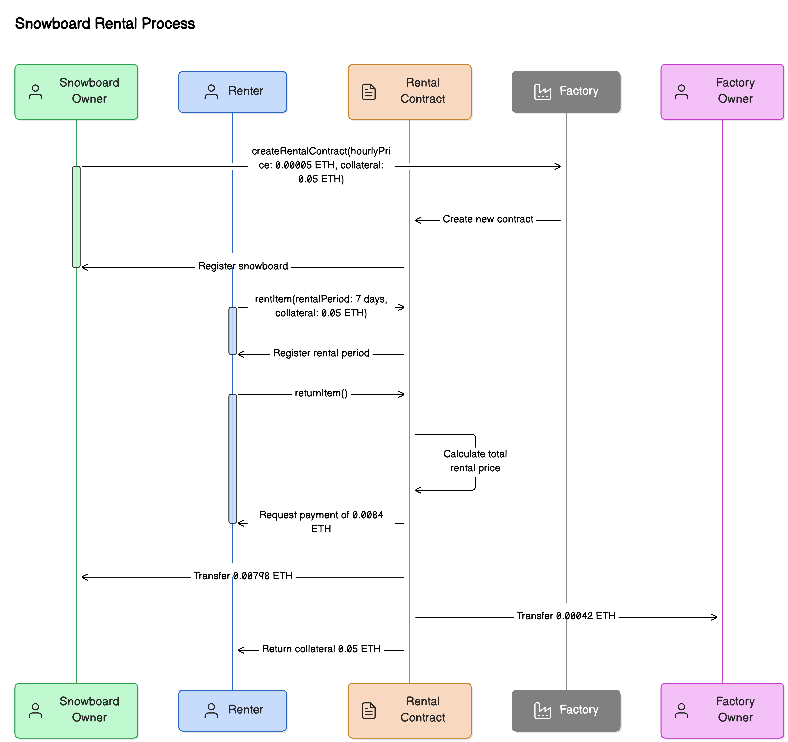

# M5 Rental Platform

M5 Rental Platform is a decentralized application (dApp) for renting items, with a focus on snowboard rentals. It utilizes smart contracts on the Ethereum blockchain to facilitate secure and transparent rental transactions.

## Smart Contract

The smart contract component of the M5 Rental Platform consists of two main contracts:

1. M5RentalContractFactory: This contract is responsible for creating individual rental contracts for each item listed on the platform.

2. M5RentalContract: This contract manages the rental process for a specific item, including renting, returning, and handling payments.

### Rental Process Flow

The following sequence diagram illustrates the snowboard rental process:

[Insert the sequence diagram here]

## Frontend

The frontend of the M5 Rental Platform is built using Next.js, providing a user-friendly interface for interacting with the smart contracts. Key features include:

- Listing items for rent
- Browsing available rental items
- Initiating and managing rental transactions
- Handling payments and collateral

## Snowboard Rental Process

## Verifier (Future Implementation)

The Verifier is a crucial component of our decentralized ecosystem, designed to enhance trust and security within the M5 Rental Platform. It's a WebAssembly (WASM) project that runs on Layer, marking one of the first steps towards a fully decentralized solution.

Key features of the Verifier:

- Utilizes the Lay3rLabs / avs-toolkit CLI for development and deployment
- Implements email-based user verification in a decentralized manner
- Generates a social score for users, enhancing platform security
- Runs as a WASM module on Layer, ensuring efficient and secure execution
- Integrates seamlessly with the rental process for enhanced user trust

The Verifier represents a significant advancement in our decentralized architecture. By leveraging WASM technology and the Layer infrastructure, we're able to perform complex verification tasks off-chain while maintaining the security and transparency benefits of blockchain technology.

Future developments will focus on expanding the Verifier's capabilities, potentially including:

- Integration with decentralized identity solutions
- Enhanced fraud detection algorithms
- Cross-platform reputation systems

As we continue to develop the Verifier, we're moving closer to our goal of a fully decentralized, secure, and efficient rental platform.

